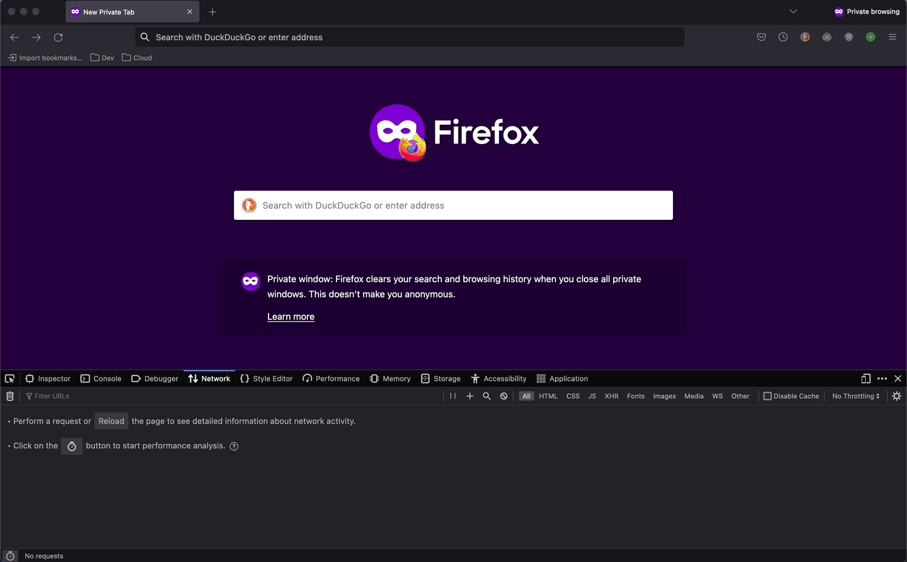
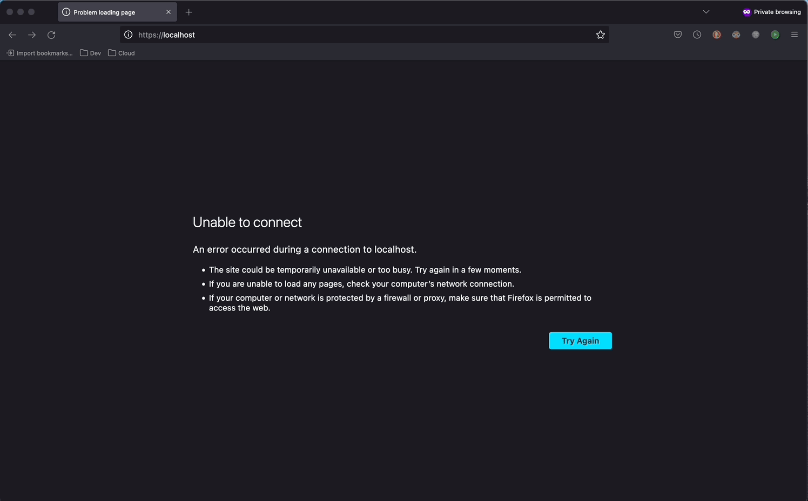

# Creoox Traefik Forward-Auth

Inspired by [traefik-forward-auth](https://github.com/thomseddon/traefik-forward-auth) by [thomseddon](https://github.com/thomseddon) (MIT License).

_cx-traefik-forward-auth_ is a standalone authorization middleware for [Traefik](https://traefik.io/traefik/) that provides OIDC authentication and/or opaque token validation (introspection) for the traefik reverse proxy. It's main goal is to work as authentication feature in API Gateway solution that Traefik provides. At the current state of implementation, the authentication is based on reading the **Authorization** header from the request and verifying it.

"Authorization": "Bearer \<access-token\>"



There are two types of verification possible:

- [Introspection](https://www.oauth.com/oauth2-servers/token-introspection-endpoint/)
- [Verifying the signature](https://developer.okta.com/docs/guides/validate-id-tokens/main/) (default)

In both cases the _introspection endpoint_ or _provider signature keys_ that are needed to verify the token are read from its [discovery endpoint](https://swagger.io/docs/specification/authentication/openid-connect-discovery/) from **OIDC_ISSUER_URL** variable. Please mind two aspects:

1. _introspection_ is only possible if the client secret was provided.
2. Currently decoding of symetrical (e.g. HS256) or eliptical (e.g. ES256 - TODO) keys is not supported.

In addition to that, it is possible to use this service to obtain the token (so it acts as OIDC Client). In order to that the **LOGIN_WHEN_NO_TOKEN** should be set to **true**.

<u>WARNING! This feature is NOT meant to be used on production.</u>



At the current state of implementation, two authentication flows are possible (both [OIDC-conformant](https://auth0.com/docs/authenticate/login/oidc-conformant-authentication)):

- [Implicit Flow](https://auth0.com/docs/authenticate/login/oidc-conformant-authentication/oidc-adoption-implicit-flow)
- [Authorization Code Flow](https://auth0.com/docs/authenticate/login/oidc-conformant-authentication/oidc-adoption-auth-code-flow) (default)

Currently tested providers:

| Provider                                               | Version | Result | Comment       |
| ------------------------------------------------------ | ------- | ------ | ------------- |
| [Keycloak](https://www.keycloak.org/)                  | 17.1    | ✅     |               |
| [SAP Commerce](https://help.sap.com/docs/SAP_COMMERCE) | ?       | ✅     |               |
| Google                                                 | ?       | ✅     | Planned       |
| GitHub                                                 |         | ✅     |               |

<br/>

# Project usage

## Prerequisites

1. Prepared traefik-based infrastructure
2. [OPTIONAL] [ModHeader](https://modheader.com/) to include authorization header in browser request

## Variables

<br/>

<details>
<summary>Environmental variables:</summary>

| Variable Name            | Type    | Obligatory | Comment                                                      |
| ------------------------ | ------- | ---------- | ------------------------------------------------------------ |
| APP_NAME                 | string  | No         | Displayed service (app) name                                 |
| APP_VERSION              | string  | No         | Displayed service (app) version                              |
| APP_PORT                 | int     | No         | Service running port                                         |
| HOST_URI                 | string  | Yes        | URI of the host the service is running on                    |
| ENVIRONMENT              | string  | Yes        | 'development' or 'production'                                |
| OIDC_ISSUER_URL          | string  | Yes        | Main Issuer's URL - all data are retrieved from there        |
| OIDC_CLIENT_ID           | string  | Yes        | OIDC client id                                               |
| OIDC_CLIENT_SECRET       | string  | No         | OIDC client secret (if set)                                  |
| OIDC_VERIFICATION_TYPE   | string  | Yes        | 'jwt' - decoding or 'introspection' - asking AS              |
| JWT_STRICT_AUDIENCE      | boolean | Yes        | true if token should be used for strict audinence only       |
| AUTH_ENDPOINT            | string  | No         | Service redirection endpoint, '/\_oauth' by default          |
| AUTH_ALLOW_UNSEC_OPTIONS | boolean | No         | Allow unsecured OPTIONS request, false by default            |
| LOGIN_WHEN_NO_TOKEN      | boolean | Yes        | true if login functionality should be on (**dev only!**)     |
| LOGIN_AUTH_FLOW          | string  | No         | 'code' (default) or 'id_token token' (implicit flow)         |
| LOGIN_SCOPE              | string  | No         | Requested scope(s), defaults to "openid email profile"       |
| LOGIN_COOKIE_NAME        | string  | No         | Name of the browser cookie, only if LOGIN_WHEN_NO_TOKEN=true |
| LOGIN_SESSION_SECRET     | string  | No         | Randomized secret for cookie-session                         |
| AUTH_ROLES_STRUCT        | string  | No         | Structure of roles (list) in token payload (**dot** notation)|
| AUTH_ROLE_NAME           | string  | No         | Role name to check in token roles                            |

Please mind that if <code>AUTH_ALLOW_UNSEC_OPTIONS</code> is set to <code>true</code>, then the endpoint that should
accept OPTIONS request, should provide separate rule for that and pass <code>X-Forwarded-Method: OPTIONS</code> header
to **cx-traefik-forward-auth** there, for instance (docker).

```yml
    ...
    labels:
      - "traefik.enable=true"
      - "traefik.http.middlewares.add-options-header.headers.customrequestheaders.X-Forwarded-Method=OPTIONS"
      - "traefik.http.routers.your-endpoint-options.rule=Host(`your-endpoint.com`) && Method(`OPTIONS`)"
      - "traefik.http.routers.your-endpoint-options.middlewares=add-options-header,cx-traefik-forward-auth"
      ...
```

Additionally, both <code>AUTH_ROLES_STRUCT</code> and <code>AUTH_ROLE_NAME</code> have to be either set or empty. Object dot notation is presented below:

`resource_access.dummy-client.roles` 

and is equall to JSON notation:

```json
...
"resource_access": {
  "dummy-client": {
    "roles": [...],
  },
},
```

</details>
<br/>

## Examples

<details>
<summary>Docker Standalone:</summary>

```yml
traefik:
    image: traefik:latest
    container_name: cx-example-traefik
    restart: unless-stopped
    security_opt:
      - no-new-privileges:true
    networks:
      - cx-example-net
    ports:
      - 80:80
      - 443:443
    volumes:
      - /etc/localtime:/etc/localtime:ro
      # - /var/run/docker.sock:/var/run/docker.sock:ro
      - ./traefik/traefik.toml:/etc/traefik/traefik.toml:ro
      - ./traefik/services.toml:/etc/traefik/services.toml:ro
      - ./traefik/acme.json:/etc/traefik/acme.json
      - ./logs/traefik-access.log:/traefik-access.log
      - ./logs/traefik-service.log:/traefik-service.log
    labels:
      - "traefik.enable=true"
      - "traefik.http.middlewares.traefik-https-redirect.redirectscheme.scheme=https"

      - "traefik.http.routers.traefik.entrypoints=web"
      - "traefik.http.routers.traefik.rule=Host(`localhost`)"
      - "traefik.http.routers.traefik.middlewares=traefik-https-redirect"

      - "traefik.http.routers.traefik-secure.entrypoints=websecure"
      - "traefik.http.routers.traefik-secure.rule=Host(`localhost`)"
      - "traefik.http.routers.traefik-secure.tls=true"
      - "traefik.http.routers.traefik-secure.tls.certresolver=hypercpq"
      - "traefik.http.routers.traefik-secure.service=api@internal"
      - "traefik.http.routers.traefik-secure.middlewares=traefik-forward-auth"

  # https://doc.traefik.io/traefik/providers/docker/#docker-api-access
  socket-proxy:
      image: tecnativa/docker-socket-proxy
      container_name: cx-example-socket-proxy
      restart: unless-stopped
      volumes:
        - /var/run/docker.sock:/var/run/docker.sock:ro
      environment:
        CONTAINERS: 1
      networks:
        - cx-example-net

  traefik-forward-auth:
    image: creoox/cx-traefik-forward-auth:1.1.4
    container_name: cx-example-traefik-forward-auth
    env_file:
      - ./cx-traefik-forward-auth.env
    networks:
      - cx-example-net
    labels:
      - "traefik.enable=true"
      - "traefik.docker.network=cx-example-net"
      - "traefik.http.middlewares.traefik-forward-auth.forwardauth.address=http://traefik-forward-auth:4181"
      - "traefik.http.middlewares.traefik-forward-auth.forwardauth.authResponseHeaders=X-Forwarded-User"
      - "traefik.http.services.traefik-forward-auth.loadbalancer.server.port=4181"
```

</details>
<br/>

<details>
<summary>Docker Swarm:</summary>

Not tested -> TODO

</details>
<br/>

<details>
<summary>Kubernetes:</summary>

Not implemented -> TODO

</details>
<br/>

# Project setup (containerized)

## Prerequisites

1. [docker](https://docs.docker.com/get-docker/)
2. [docker-compose](https://docs.docker.com/compose/install/)
3. [Optional & <u>HIGHLY</u> Recommended] **GNU make** (see below)

### GNU make - Make use of _Makefile_

It is recommended to make use of _make_ commands and in order to do so install _GNU make_

- Unix/Linux -> ready-to-go [more info](https://makefiletutorial.com/#running-the-examples)
- Windows (Powershell) -> [install chocolatey](https://chocolatey.org/install) and then run `choco install make` in **Powershell**
- MacOS -> for most recent versions you should be ready-to-go, if not try installing it with [homebrew](https://formulae.brew.sh/formula/make)

## Environments setup

**Mind that all below commands can be run natively using docker-compose (not recommended, see _Makefile_ for details)**

<br/>

<details>
<summary>Development Environment:</summary>

### Prepare development environment

```shell
make build-dev-env
```

### Run development environment

```shell
make run-dev-env
```

### Run unit tests (in separate container)

```shell
make run-unit-tests
```

### Run unit tests with coverage HTML-report (in separate container)

```shell
make run-ut-coverage-html
```

### Run lint check (in separate container)

```shell
make run-lint-check
```

### Shut down and clean development environment

```
make down-dev-env
```

</details>
<br/>

<details>
<summary>Production Environment:</summary>

### Prepare production environment

```shell
make pull-prod-env
```

You may use `make build-prod-env` for environment build, mind that it's meant for **developers only**!

### Run production environment

```shell
make run-prod-env
```

### Shut down and clean production environment

```shell
make down-prod-env
```

</details>
